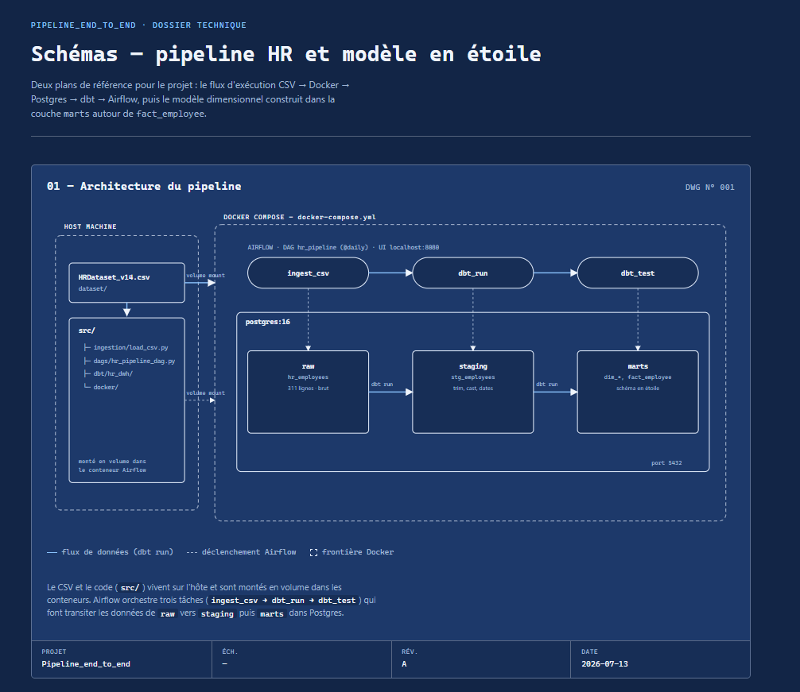
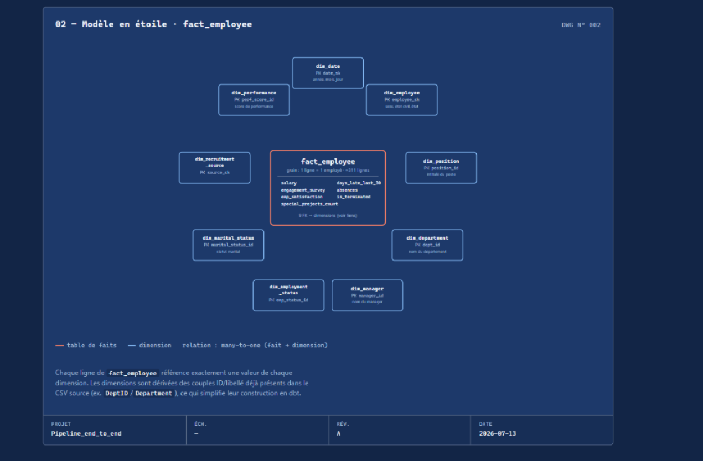

# Pipeline HR — CSV → Airflow → dbt → PostgreSQL

Projet de data engineering end-to-end, à but d'apprentissage : ingestion d'un fichier CSV de données RH,
transformation en un entrepôt de données en **schéma en étoile** avec [dbt](https://www.getdbt.com/), le
tout orchestré par [Apache Airflow](https://airflow.apache.org/) et hébergé dans des conteneurs Docker.

## Source des données

[`dataset/HRDataset_v14.csv`](dataset/HRDataset_v14.csv) — 311 employés, 36 colonnes (HR Dataset v14, un
jeu de données RH fictif largement utilisé pour l'apprentissage de l'analytique).

## Architecture

Le CSV et le code (`src/`) vivent sur l'hôte et sont montés en volume dans les conteneurs. Airflow
orchestre trois tâches (`ingest_csv → dbt_run → dbt_test`) qui font transiter les données de `raw` vers
`staging` puis `marts` dans Postgres.



## Modèle de données — schéma en étoile

`fact_employee` (grain : 1 ligne = 1 employé) est entourée de 9 dimensions, dérivées des couples
ID/libellé déjà présents dans le CSV source.



## Stack technique

| Brique | Rôle |
|---|---|
| **PostgreSQL 16** | Entrepôt de données (schémas `raw`/`staging`/`marts`) + métadonnées Airflow |
| **dbt-core** | Transformation SQL : nettoyage (staging) et modélisation dimensionnelle (marts) |
| **Apache Airflow** | Orchestration du pipeline (LocalExecutor) |
| **Docker Compose** | Conteneurisation de l'ensemble |
| **Python / pandas** | Script d'ingestion du CSV vers Postgres |

## Structure du projet

```
Pipeline_end_to_end/
├── dataset/
│   └── HRDataset_v14.csv
├── docs/                          # Schémas d'architecture
├── src/
│   ├── docker/
│   │   ├── docker-compose.yml     # postgres + airflow-init/webserver/scheduler
│   │   ├── Dockerfile             # image Airflow + dépendances (dbt-postgres, pandas...)
│   │   ├── .env                   # identifiants Postgres (non versionné)
│   │   └── sql/                   # scripts d'init (schémas, base airflow)
│   ├── ingestion/
│   │   └── load_csv.py            # charge le CSV dans raw.hr_employees
│   ├── dags/
│   │   └── hr_pipeline_dag.py     # DAG Airflow : ingest_csv >> dbt_run >> dbt_test
│   └── dbt/hr_dwh/
│       ├── models/staging/        # stg_employees : nettoyage, typage, dates
│       └── models/marts/          # 9 dimensions + fact_employee
├── requirements.txt
└── PLAN.md                        # journal de bord détaillé du projet, phase par phase
```

## Le modèle dimensionnel

**Dimensions** : `dim_department`, `dim_position`, `dim_manager`, `dim_performance`,
`dim_employment_status`, `dim_marital_status`, `dim_recruitment_source`, `dim_date`, `dim_employee`.

**Table de faits** — `fact_employee` : une clé étrangère vers chaque dimension, et les mesures suivantes :
`salary`, `engagement_survey`, `emp_satisfaction`, `special_projects_count`, `days_late_last_30`,
`absences`, `is_terminated`.

## Qualité des données

Le CSV source contient plusieurs défauts corrigés au fil du pipeline :
- BOM UTF-8, espaces parasites sur les colonnes texte, formats de date hétérogènes.
- `Zip` perdait son zéro de tête lors de l'ingestion (déduit comme numérique par pandas) → corrigé en
  Phase 3 (`lpad`).
- `to_date(..., 'MM/DD/YY')` plaçait certaines dates de naissance dans le futur (pivot de siècle ambigu de
  Postgres) → corrigé en forçant explicitement le préfixe `19`.
- Quelques identifiants (`dept_id`, `perf_score_id`, `emp_status_id`) pointent vers plusieurs libellés dans
  le CSV source (fautes de saisie) → résolus par vote majoritaire dans les modèles dbt correspondants.
- `dim_position` et `dim_manager` conservent quelques imperfections documentées (plusieurs intitulés de
  poste partagent un même ID sans majorité claire ; un même manager a parfois deux ID différents) —
  limitations connues, volontairement non « corrigées » pour éviter d'inventer une règle arbitraire.

Détails complets dans [`PLAN.md`](PLAN.md).

## Lancer le projet

```powershell
cd src/docker
docker compose up -d --build
```

- **Postgres** : `localhost:5432` (base `hr`, identifiants dans `.env`)
- **Airflow UI** : http://localhost:8080 (`admin` / `admin`)

Depuis l'UI Airflow, active puis déclenche le DAG `hr_pipeline`.

### Exécuter dbt en local (hors Airflow)

```powershell
cd src/dbt/hr_dwh
$env:DBT_PROFILES_DIR = "."
dbt run
dbt test
```

## Aller plus loin

Le modèle en étoile (`marts.dim_*` + `marts.fact_employee`) peut être connecté directement à un outil BI
comme Power BI Desktop (connecteur PostgreSQL, `localhost:5432`, base `hr`, schéma `marts`).
